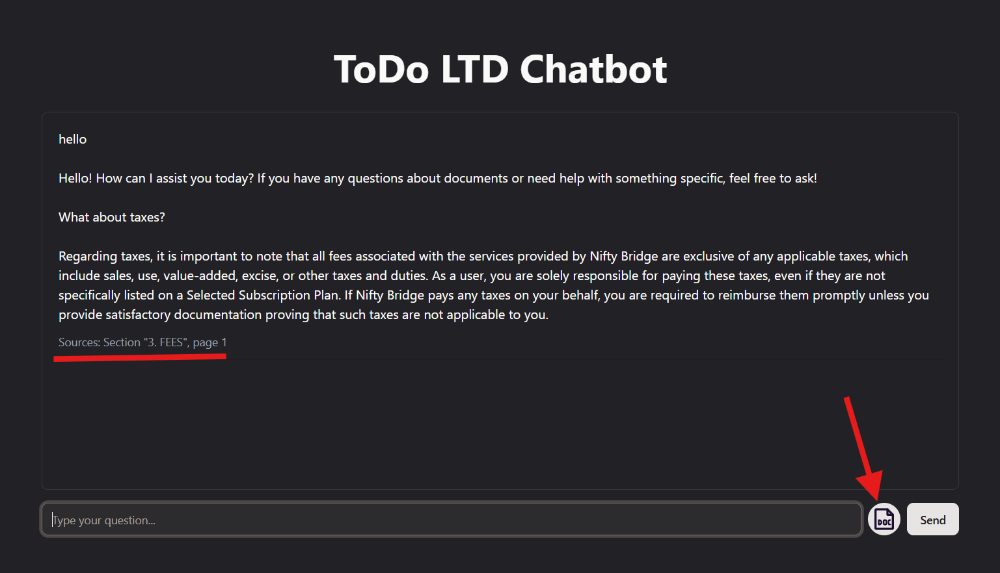

# 🤖 RAG Чат-бот з документацією

Чат-бот побудований на основі RAG-підходу (Retrieval-Augmented Generation), який відповідає на питання користувача на основі завантаженої документації. Підтримує формати PDF, TXT та MD.



## 🌐 Демо

👉 [https://todo-frontend-6zg2.onrender.com](https://todo-frontend-6zg2.onrender.com)

## 📬 Контакти

З будь-яких питань звертайтесь у Telegram: [@staskazakovcom](https://t.me/staskazakovcom)

---

## 🛠 Технології

### Backend
- **FastAPI** — швидкий та зручний Python-фреймворк для побудови REST API
- **OpenAI API (GPT-4o-mini)** — генерація відповідей на основі контексту
- **OpenAI Embeddings (text-embedding-3-small)** — створення векторних представлень тексту
- **FAISS** — локальна векторна база даних для зберігання та пошуку ембедингів
- **PyPDF** — парсинг PDF-документів

### Frontend
- **Next.js 16** — React-фреймворк для побудови веб-інтерфейсу
- **Tailwind CSS** — стилізація компонентів
- **shadcn/ui** — готові UI-компоненти

### Інфраструктура
- **Docker** — контейнеризація проєкту
- **Render** — деплой фронтенду та бекенду

---

## 🚀 Запуск проєкту

### Спосіб 1: Готовий Docker-образ (найпростіший)

1. Створіть папку та перейдіть до неї:
```bash
mkdir todo-chatbot && cd todo-chatbot
```

2. Створіть файл `.env` на основі прикладу з репозиторію:
```bash
# .env
OPENAI_API_KEY=your_openai_api_key
NEXT_PUBLIC_API_URL=http://localhost:8000
```

3. Завантажте та запустіть контейнер:
```bash
docker pull urgor/todo-app
docker run --env-file .env -p 8000:8000 -p 3000:3000 urgor/todo-app
```

4. Відкрийте браузер: [http://localhost:3000](http://localhost:3000)

---

### Спосіб 2: Зібрати образ з Dockerfile

1. Клонуйте репозиторій:
```bash
git clone https://github.com/StasKazakov/todo.git
cd todo
```

2. Створіть `.env` файл (дивіться `.env.example` в корені проєкту)

3. Зберіть та запустіть образ:
```bash
docker build -t todo-app .
docker run --env-file .env -p 8000:8000 -p 3000:3000 todo-app
```

4. Відкрийте браузер: [http://localhost:3000](http://localhost:3000)

---

### Спосіб 3: Запуск локально без Docker

1. Клонуйте репозиторій:
```bash
git clone https://github.com/StasKazakov/todo.git
cd todo
```

2. **Бекенд** — відкрийте перший термінал:
```bash
cd backend
python -m venv venv
venv\Scripts\activate        # Windows
# або source venv/bin/activate  # Mac/Linux
pip install -r requirements.txt
```

Створіть `.env` файл у папці `backend`:
```bash
OPENAI_API_KEY=your_openai_api_key
```

Запустіть бекенд:
```bash
uvicorn main:app --reload --port 8000
```

3. **Фронтенд** — відкрийте другий термінал:
```bash
cd frontend
npm install
```

Створіть `.env` файл у папці `frontend`:
```bash
NEXT_PUBLIC_API_URL=http://localhost:8000
```

Запустіть фронтенд:
```bash
npm run dev
```

4. Відкрийте браузер: [http://localhost:3000](http://localhost:3000)

---

## 📋 Змінні оточення

Дивіться `.env.example` у корені проєкту:

```env
OPENAI_API_KEY=         # API ключ OpenAI
NEXT_PUBLIC_API_URL=    # URL бекенду (наприклад http://localhost:8000)
```

---

## 📡 API Endpoints

- `POST /api/chat` — надіслати питання та отримати відповідь
- `POST /api/upload` — завантажити документ (PDF, TXT, MD)
- `GET /api/health` — перевірка стану сервісу

FastAPI автоматично генерує інтерактивну Swagger-документацію, де можна протестувати всі endpoints прямо у браузері:
👉 [https://todo-backend-m0sw.onrender.com/docs](https://todo-backend-m0sw.onrender.com/docs)

---

## 💬 Як користуватись

1. Відкрийте інтерфейс у браузері
2. Натисніть кнопку 📄 та завантажте документ (PDF, TXT або MD)
3. Зачекайте поки документ обробиться
4. Введіть питання у поле та натисніть **Send**
5. Отримайте відповідь з посиланням на джерело
